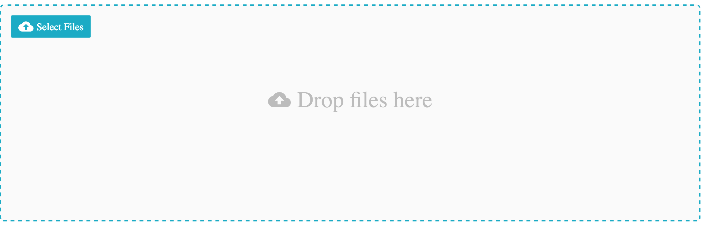

<a href="http://fineuploader.com">
   
   
</a>

[](https://www.npmjs.com/package/react-fine-uploader)
[](LICENSE)
[](https://travis-ci.org/FineUploader/react-fine-uploader)

Makes using [Fine Uploader](http://fineuploader.com) in a React app simple. Drop-in high-level components for a turn-key UI. Use small focused components to build a more custom UI.

## Docs

### Supported browsers

- Chrome (desktop & mobile)
- Firefox
- Internet Explorer 11
- Microsoft Edge 13+
- Safari 9+ (desktop & mobile)

### Overview

React Fine Uploader makes using Fine Uploader and all of its unique features very simple in a React-based project. This library provides useful resources that can be divided into three sections:

#### Individual focused components (like `<Thumbnail>` and `<ProgressBar>`).

These allow you to easily build a highly customizable and powerful UI for your upload widget, backed by Fine Uploader's core feature set. Most of these components are unstyled (i.e. ready to be styled by you). Focused component-specific stylesheets may be provided at a later date.


#### Higher-level components (like `<Gallery>`)

These combine many focused components that provide style (which can be adjusted via your own stylesheet) and enhanced UI-specific features. These components are essentially "turn-key", which means that you can get a fully functional upload widget up and running in your project with a few lines of code. Keep in mind that of course you still need a server to handle the requests sent by Fine Uploader and to server up the JavaScript and CSS files.

#### Wrapper classes

These wrap a Fine Uploader instance for use in React Fine Uploader. They provide additional features such as the ability to dynamically register multiple event/callback listeners. All individual and high-level/focused components require you to pass a constructed wrapper class instance.

More information, such as examples and API documentation, can be found in the README of the [fine-uploader-wrappers project](https://github.com/FineUploader/fine-uploader-wrappers).

### Quick Reference

- [Installing](#installing)
- [High-level Components](#high-level-components)
   - [`<Gallery />`](#gallery-)
- [Low-level Components](#low-level-components)
   - [`<CancelButton />`](#cancelbutton-)
   - [`<DeleteButton />`](#deletebutton-)
   - [`<Dropzone />`](#dropzone-)
   - [`<FileInput />`](#fileinput-)
   - [`<Filename />`](#filename-)
   - [`<Filesize />`](#filesize-)
   - [`<PauseResumeButton />`](#pauseresumebutton-)
   - [`<ProgressBar />`](#progressbar-)
   - [`<RetryButton />`](#retrybutton-)
   - [`<Status />`](#status-)
   - [`<Thumbnail />`](#thumbnail-)

### Installing

Two dependencies that you will need to install yourself: an A+/Promise spec compliant polyfill (for IE11) and React (which is a peer dependency). Simply `npm install react-fine-uploader` and see the documentation for your specific integration instructions (based on your needs). You will also need to install [Fine Uploader](https://github.com/FineUploader/fine-uploader) as well, which is also [available on npm](https://www.npmjs.com/package/fine-uploader).

### High-level Components

#### `<Gallery />`

Similar to the Fine Uploader UI gallery template, the `<Gallery />` component lays out an uploader using all of the available [low-level components](#low-level-components). Appealing styles are provided, which can be easily overriden in your own style sheet.

In the `<Gallery />` component, each file is rendered as a "card". CSS transitions are used to fade a card in when a file is submitted and then fade it out again when the file is either canceled during uploading or deleted after uploading. By default, a file input element is rendered and styled to allow access to the file chooser. And, if supported by the device, a drop zone is rendered as well.

##### Properties

The only required property is `uploader`, which must be a Fine Uploader [wrapper class](#wrapper-classes) instance. But you can pass any property supported by any low-level component through `<Gallery />` by following this simple convention: `{lowerCamelCaseComponentName}-{propertyName}: {value}`. For example, if you want to specify custom child elements for the [`<FileInput />` element](#fileinput-), you would initialize the component like so:

```js
const fileInputChildren = <span>Choose files</span>

render() {
   return (
      <Gallery fileInput-children={ fileInputChildren } uploader={ uploader } />
   )
}
```

And if you wanted to instead change the rendered text for the [`<Status />` element](#status-) when the file uploads successfully, you would initialize your component like this:

```js
const statusTextOverride = {
   upload_successful: 'Success!'
}

render() {
   return (
      <Gallery status-text={ { text: statusTextOverride } } uploader={ uploader } />
   )
}
```

Note that you can also disable some components by passing a `disabled` property. Currently, this is limited to the `<FileInput />` component and the `<Dropzone />` component. For example, if you wanted to prevent file dropping, your code would look similar to this:

```js
render() {
   return (
      <Gallery dropzone-disabled={ true } uploader={ uploader } />
   )
}
```

Finally, you may disable the add/remove file animations by setting the `animationsDisabled` property to `true`.

##### A simple example

For example, if you render a `<Gallery />` component using the following code:

```js
import React, { Component } from 'react'

import FineUploaderTraditional from 'fine-uploader-wrappers'
import Gallery from 'react-fine-uploader'

// ...or load this specific CSS file using a <link> tag in your document
import 'react-fine-uploader/gallery/gallery.css'

const uploader = new FineUploaderTraditional({
    options: {
        chunking: {
            enabled: true
        },
        deleteFile: {
            enabled: true,
            endpoint: '/uploads'
        },
        request: {
            endpoint: '/uploads'
        },
        retry: {
            enableAuto: true
        }
    }
})

class UploadComponent extends Component {
    render() {
        return (
            <Gallery uploader={ uploader } />
        )
    }
}

export default UploadComponent
```

...you will see this initial UI on page load:



After setting up a [server to handle the upload and delete requests](http://docs.fineuploader.com/branch/master/quickstart/03-setting_up_server.html), and dropping a few files, you will see a modern-looking upload user interface with your files represented like so:


### Low-level Components

#### `<CancelButton />`

The `<CancelButton />` component allows you to easily render a useable cancel button for a submitted file. An file can be "canceled" at any time, except after it has uploaded successfully, and before it has passed validation (and of course after it has already been canceled).

By default, the `<CancelButton />` will be rendered and clickable only when the associated file is eligible for cancelation. Otherwise, the component will _not_ render a button. In other words, once, for example, the associated file has been canceled or has uploaded successfully, the button will essentially disappear. You can change this behavior by setting appropriate options.

##### Properties

- `children` - (child elements/components of `<CancelButton>`. Use this for any text of graphics that you would like to display inside the rendered button. If the component is childless, the button will be rendered with a simple text node of "Cancel".

- `id` - The Fine Uploader ID of the submitted file. (required)

- `onlyRenderIfCancelable` - Defaults to `true`. If set to `false`, the element will be rendered as a disabled button if the associated file is not cancelable.

- `uploader` - A Fine Uploader [wrapper class](#wrapper-classes). (required)

The example below will include a cancel button for each submitted file along with a [`<Thumbnail />`](#thumbnail-), and will ensure the elements representing a file are removed if the file is canceled.

```javascript
import React, { Component } from 'react'
import ReactDOM from 'react-dom'

import CancelButton from 'react-fine-uploader/cancel-button'
import FineUploaderTraditional from 'fine-uploader-wrappers'
import Thumbnail from 'react-fine-uploader/thumbnail'

const uploader = new FineUploaderTraditional({
   options: {
      request: {
         endpoint: 'my/upload/endpoint'
      }
   }
})

export default class FileListener extends Component {
    constructor() {
        super()

        this.state = {
            submittedFiles: []
        }
    }

    componentDidMount() {
        uploader.on('statusChange', (id, oldStatus, newStatus) => {
            if (newStatus === 'submitted') {
                const submittedFiles = this.state.submittedFiles

                submittedFiles.push(id)
                this.setState({ submittedFiles })
            }
            else if (isFileGone(newStatus)) {
                const submittedFiles = this.state.submittedFiles
                const indexToRemove = submittedFiles.indexOf(id)

                submittedFiles.splice(indexToRemove, 1)
                this.setState({ submittedFiles })
            }
        })
    }

    render() {
        return (
            <div>
                {
                   this.state.submittedFiles.map(id => {
                        <div key={ id }>
                           <Thumbnail id={ id } uploader={ uploader } />
                           <CancelButton id={ id } uploader={ uploader } />
                        </div>
                    })
                }
            </div>
        )
    }
}

const isFileGone = status => {
    return [
        'canceled',
        'deleted',
    ].indexOf(status) >= 0
}
```

You may pass _any_ standard [`<button>` attributes](https://developer.mozilla.org/en-US/docs/Web/HTML/Element/button) (or any standard element attributes, such as `data-` attributes) to the `<CancelButton />` as well. These attributes will be attached to the underlying `<button>` element.

#### `<DeleteButton />`

The `<DeleteButton />` component allows you to easily render a useable delete button for an uploaded file. An file can be deleted from the server if the option has been enabled and if the file has already uploaded successfully.

By default, the `<DeleteButton />` will be rendered and clickable only when the associated file is eligible for deletion. Otherwise, the component will _not_ render a button. In other words, once, for example, the associated file has been deleted, or while it is still uploading, the button will not be visible. You can change this behavior by setting appropriate options.

##### Properties

- `children` - (child elements/components of `<DeleteButton>`. Use this for any text of graphics that you would like to display inside the rendered button. If the component is childless, the button will be rendered with a simple text node of "Delete".

- `id` - The Fine Uploader ID of the submitted file. (required)

- `onlyRenderIfDeletable` - Defaults to `true`. If set to `false`, the element will be rendered as a disabled button if the associated file is not deletable.

- `uploader` - A Fine Uploader [wrapper class](#wrapper-classes). (required)

The example below will include a delete button for each submitted file along with a [`<Thumbnail />`](#thumbnail-), and will ensure the elements representing a file are removed if the file is deleted.

```javascript
import React, { Component } from 'react'

import DeleteButton from 'react-fine-uploader/delete-button'
import FineUploaderTraditional from 'fine-uploader-wrappers'
import Thumbnail from 'react-fine-uploader/thumbnail'

const uploader = new FineUploaderTraditional({
   options: {
      deleteFile: {
         enabled: true,
         endpoint: 'my/delete/endpoint'
      },
      request: {
         endpoint: 'my/upload/endpoint'
      }
   }
})

export default class FileListener extends Component {
    constructor() {
        super()

        this.state = {
            submittedFiles: []
        }
    }

    componentDidMount() {
        uploader.on('statusChange', (id, oldStatus, newStatus) => {
            if (newStatus === 'submitted') {
                const submittedFiles = this.state.submittedFiles

                submittedFiles.push(id)
                this.setState({ submittedFiles })
            }
            else if (isFileGone(newStatus)) {
                const submittedFiles = this.state.submittedFiles
                const indexToRemove = submittedFiles.indexOf(id)

                submittedFiles.splice(indexToRemove, 1)
                this.setState({ submittedFiles })
            }
        })
    }

    render() {
        return (
            <div>
                {
                   this.state.submittedFiles.map(id => {
                        <div key={ id }>
                           <Thumbnail id={ id } uploader={ uploader } />
                           <DeleteButton id={ id } uploader={ uploader } />
                        </div>
                    })
                }
            </div>
        )
    }
}

const isFileGone = status => {
    return [
        'canceled',
        'deleted',
    ].indexOf(status) >= 0
}
```

You may pass _any_ standard [`<button>` attributes](https://developer.mozilla.org/en-US/docs/Web/HTML/Element/button) (or any standard element attributes, such as `data-` attributes) to the `<DeleteButton />` as well. These attributes will be attached to the underlying `<button>` element.

#### `<Dropzone />`

This component provides an element that will accept dropped files or directories to be passed on to an underlying Fine Uploader instance. By default, the rendered component itself will accept these files, but you can also register another element in the DOM (such as `document.body`) to receive dropped files instead.

##### Properties

- `dropActiveClassName` - Directly maps to the [`classes.dropActive property` on Fine Uploader's standalone drag-and-drop module](http://docs.fineuploader.com/branch/master/features/drag-and-drop.html#classes.dropActive).

- `element` - The DOM element to register as a drop zone. If omitted, the rendered `<Dropzone />` element will become the drop zone.

- `multiple` - Directly maps to the [`allowMultipleItems` property on Fine Uploader's standalone drag-and-drop module](http://docs.fineuploader.com/branch/master/features/drag-and-drop.html#allowMultipleItems).

- `onDropError` - Directly maps to the [`callbacks.dropError` option on Fine Uploader's standalone drag-and-drop module](http://docs.fineuploader.com/branch/master/features/drag-and-drop.html#dropError). React Fine Uploader will log any errors when the underlying DnD instance invokes the `dropError` callback, but you can specify additional behavior as well.

- `onProcesssingDroppedFiles` - Directly maps to the [`callbacks.processingDroppedFiles` option on Fine Uploader's standalone drag-and-drop module](http://docs.fineuploader.com/branch/master/features/drag-and-drop.html#processingDroppedFiles).

- `onProcessingDroppedFilesComplete` - Directly maps to the [`callbacks.processingDroppedFilesComplete` option on Fine Uploader's standalone drag-and-drop module](http://docs.fineuploader.com/branch/master/features/drag-and-drop.html#processingDroppedFilesComplete). React Fine Uploader will send all files to the underlying Fine Uploader instance when this callback is invoked, but you may specify additional logic as well.

- `uploader` - The only required option - a Fine Uploader [wrapper class](#wrapper-classes).

A _very_ simple but completely functional and effective use of the `<Dropzone />` component can be seen below. This will render an element on the page that accepts files (all supported browsers) or even directories (Chrome & Opera only) and then submits them to Fine Uploader:

```javascript
import React from 'react'
import ReactDOM from 'react-dom'

import Dropzone from 'react-fine-uploader/dropzone'
import FineUploaderTraditional from 'fine-uploader-wrappers'

const uploader = new FineUploaderTraditional({
   options: {
      request: {
         endpoint: 'my/upload/endpoint'
      }
   }
})

const dropzone = (
    <Dropzone style={ { border: '1px dotted', height: 200, width: 200 } }
              uploader={ uploader }
    >
        <span>Drop Files Here</span>
    </Dropzone>
)

ReactDOM.render(
    dropzone,
    document.getElementById('content')
)
```

#### `<FileInput />`

The `<FileInput />` component allows you to easily render and style an `<input type="file">` element and connect it to a Fine Uploader instance. When any files are selected via the file chooser dialog, they will be submitted directly to the associated Fine Uploder instance.

##### Properties

- `text` - An object that holds properties used to render text for the two possible button states. If you pass a `multiple` boolean attribute, then the `text.selectFiles` value will be rendered (which defaults to "Select Files"). If you do not pass a `multiple` boolean attribute, then the `text.selectFile` value will be rendered instead (which defaults to "Select a File"). This property is ignored if you pass child elements (`children`).

- `uploader` - A Fine Uploader [wrapper class](#wrapper-classes). (required)

For example, suppose you wanted to create a file input button with an upload icon and some text that allows the user to select multiple files, but excludes everything but images in the chooser dialog ([where supported](https://developer.mozilla.org/en-US/docs/Web/HTML/Element/input#Browser_compatibility)). When files are selected by the user, they should be submitted directly to a Fine Uploader traditional endpoint handler:

Note: This assumes you have [the Ionicons CSS file](http://ionicons.com/#cdn) loaded on your page, _and_ that you have an element on your page with an ID of "content".

```javascript
import React from 'react'
import ReactDOM from 'react-dom'

import FileInput from 'react-fine-uploader/file-input'
import FineUploaderTraditional from 'fine-uploader-wrappers'

const uploader = new FineUploaderTraditional({
   options: {
      request: {
         endpoint: 'my/upload/endpoint'
      }
   }
})

const fileInput = (
   <FileInput multiple accept='image/*' uploader={ uploader }>
      <span class="icon ion-upload">Choose Files</span>
   </FileInput>
)

ReactDOM.render(
    fileInput,
    document.getElementById('content')
)
```

You may pass _any_ [standard `<input type="file">` attributes](https://developer.mozilla.org/en-US/docs/Web/HTML/Element/input) to the `<FileInput />` component.

#### `<Filename />`

The `<Filename />` component renders the initial name of the associated file _and_ updates when the file's name is changed through the API.

##### Properties

- `id` - The Fine Uploader ID of the submitted file. (required)

- `uploader` - A Fine Uploader [wrapper class](#wrapper-classes). (required)

Suppose you wanted to render a filename for each file as new files are submitted to Fine Uploader. Your React component may look like this:

Note: This assumes you have additional components or code to allow files to actually be submitted to Fine Uploader.

```javascript
import React, { Component } from 'react'

import FineUploaderTraditional from 'fine-uploader-wrappers'
import Filename from 'react-fine-uploader/filename'

const uploader = new FineUploaderTraditional({
   options: {
      request: {
         endpoint: 'my/upload/endpoint'
      }
   }
})

export default class FileListener extends Component {
    constructor() {
        super()

        this.state = {
            submittedFiles: []
        }
    }

    componentDidMount() {
        uploader.on('submitted', id => {
            const submittedFiles = this.state.submittedFiles

            submittedFiles.push(id)
            this.setState({ submittedFiles })
        })
    }

    render() {
        return (
            <div>
                {
                    this.state.submittedFiles.map(id => (
                        <Filename id={ id } uploader={ uploader } />
                    ))
                }
            </div>
        )
    }
}
```

#### `<Filesize />`

The `<Filesize />` component renders the size of a specific file, formatted based on the a set of customizable rules.
It also accounts for scaled images, which do not have a file size available until upload time.

The internal logic of this component uses the IEEE definition when determining whether to display the
size as kilobytes, megabytes, gigabytes, or terabytes. For example, 1100 bytes is represented, by default,
as "1.10 KB".

##### Properties

- `id` - The Fine Uploader ID of the submitted file. (required)

- `units` - An object containing printable text for each size unit. The size unit keys include
`byte`, `kilobyte`, `megabyte`, `gigabyte`, and `terabyte`. The default text values for these units are
`B`, `KB`, `MB`, `GB`, and `TB` (respectively).

- `uploader` - A Fine Uploader [wrapper class](#wrapper-classes). (required)

Suppose you wanted to render a file size for each file as new files are submitted to Fine Uploader. Your React component may look like this:

Note: This assumes you have additional components or code to allow files to actually be submitted to Fine Uploader.

```javascript
import React, { Component } from 'react'

import FineUploaderTraditional from 'fine-uploader-wrappers'
import Filesize from 'react-fine-uploader/filesize'

const uploader = new FineUploaderTraditional({
   options: {
      request: {
         endpoint: 'my/upload/endpoint'
      }
   }
})

export default class FileListener extends Component {
    constructor() {
        super()

        this.state = {
            submittedFiles: []
        }
    }

    componentDidMount() {
        uploader.on('submitted', id => {
            const submittedFiles = this.state.submittedFiles

            submittedFiles.push(id)
            this.setState({ submittedFiles })
        })
    }

    render() {
        return (
            <div>
                {
                    this.state.submittedFiles.map(id => (
                        <Filesize id={ id } uploader={ uploader } />
                    ))
                }
            </div>
        )
    }
}
```

If you wanted to display units as "bytes", "kilobytes", etc (instead of the default text), your `FileSize`
component would look like this instead:

```javascript
const customUnits = {
    byte: 'bytes',
    kilobyte: 'kilobytes',
    megabyte: 'megabytes',
    gigabyte: 'gigabytes',
    terabyte: 'terabytes'
}

<Filesize id={ id } units={ customUnits } uploader={ uploader } />
```

#### `<PauseResumeButton />`

The `<PauseResumeButton />` component allows you to easily render a useable pause/resume button for a submitted file. An file can be "paused" manually when the upload is in progress after at least one chunk has uploaded successfully. A paused upload can then be resumed by pressing the same button.

When a file can be paused, the word "Pause" will appear in the button if no `pauseChildren` property has been specified. When it can be resumed, the button will be changed to "Resume" if no `resumeChildren` property has been defined. The former case will pause the upload on click, and the latter will resume. If the file cannot be paused or resumed, by default, the button will not be rendered.

##### Properties

- `id` - The Fine Uploader ID of the submitted file. (required)

- `onlyRenderIfEnabled` - Defaults to `true`. If set to `false`, the element will be rendered as a disabled button if the associated file is both not pausable and not resumable.

- `pauseChildren` - (child elements/components of `<RetryButton>`. Use this for any text of graphics that you would like to display inside the rendered pause button. If the component is childless, the button will be rendered with a simple text node of "Pause".

- `resumeChildren` - (child elements/components of `<RetryButton>`. Use this for any text of graphics that you would like to display inside the rendered resume button. If the component is childless, the button will be rendered with a simple text node of "Resume".

- `uploader` - A Fine Uploader [wrapper class](#wrapper-classes). (required)

The example below will include a pause/resume button for each submitted file along with a [`<Thumbnail />`](#thumbnail-).

```javascript
import React, { Component } from 'react'

import FineUploaderTraditional from 'fine-uploader-wrappers'
import PauseResumeButton from 'react-fine-uploader/pause-resume-button'
import Thumbnail from 'react-fine-uploader/thumbnail'

const uploader = new FineUploaderTraditional({
   options: {
      request: {
         endpoint: 'my/upload/endpoint'
      }
   }
})

export default class FileListener extends Component {
    constructor() {
        super()

        this.state = {
            submittedFiles: []
        }
    }

    componentDidMount() {
        uploader.on('statusChange', (id, oldStatus, newStatus) => {
            if (newStatus === 'submitted') {
                const submittedFiles = this.state.submittedFiles

                submittedFiles.push(id)
                this.setState({ submittedFiles })
            }
        })
    }

    render() {
        return (
            <div>
                {
                   this.state.submittedFiles.map(id => {
                        <div key={ id }>
                           <Thumbnail id={ id } uploader={ uploader } />
                           <PauseResumeButton id={ id } uploader={ uploader } />
                        </div>
                    ))
                }
            </div>
        )
    }
}
```

You may pass _any_ standard [`<button>` attributes](https://developer.mozilla.org/en-US/docs/Web/HTML/Element/button) (or any standard element attributes, such as `data-` attributes) to the `<PauseResumeButton />` as well. These attributes will be attached to the underlying `<button>` element.

#### `<ProgressBar />`

The ProgressBar component allows for a per-file _or_ a total progress bar to be rendered and automatically updated
by the underlying upload wrapper instance. This covers the per-file and total progress bar elements found in Fine Uploader UI. This progress bar itself is made up of a container element and a child element that marks the file progress.

##### Properties

- `id` - If this is a per-file progress bar, specify the ID of the file to monitor. For a total progress bar, omit this
property.

- `hideBeforeStart` - Defaults to `true`, which ensures the progress bar is not visible until the associated file has
started uploading. For total progress bars, this stays hidden until at least one file has started uploading.

- `hideOnComplete` - Defaults to `true`, which ensures the progress bar is no longer visible once the associated file
has completed uploading. For total progress bars, the bar is hidden once _all_ files have completed uploading.

- `uploader` - The only required option - a Fine Uploader [wrapper class](#wrapper-classes).

Consider embedding a per-file `<ProgressBar />`, such as `<ProgressBar id={ 3 } uploader={ uploader } />`, alongside
a [`<Thumbnail />` component](#thumbnail-) for the same file. A total progress bar - `<ProgressBar uploader={ uploader } />` - should probably be included before the container element that holds all file
`<Thumbnail />` elements, such as at the top of a [`<Dropzone />`](#dropzone-).

#### `<RetryButton />`

The `<RetryButton />` component allows you to easily render a useable retry button for a submitted file. An file can be "retried" manually after all auto retries have been exhausted on an upload failed _and_ if the [server has not forbidden retries in the upload response](http://docs.fineuploader.com/branch/master/api/options.html#retry.preventRetryResponseProperty).

By default, the `<RetryButton />` will be rendered and clickable only when the associated file is eligible to be manually retried. Otherwise, the component will _not_ render a button. In other words, once, for example, the associated file has been canceled or has uploaded successfully, the button will essentially disappear. You can change this behavior by setting appropriate options

##### Properties

- `children` - (child elements/components of `<RetryButton>`. Use this for any text of graphics that you would like to display inside the rendered button. If the component is childless, the button will be rendered with a simple text node of "Retry".

- `id` - The Fine Uploader ID of the submitted file. (required)

- `onlyRenderIfRetryable` - Defaults to `true`. If set to `false`, the element will be rendered as a disabled button if the associated file is not retryable.

- `uploader` - A Fine Uploader [wrapper class](#wrapper-classes). (required)

The example below will include a retry button for each submitted file along with a [`<Thumbnail />`](#thumbnail-).

```javascript
import React, { Component } from 'react'

import FineUploaderTraditional from 'fine-uploader-wrappers'
import RetryButton from 'react-fine-uploader/retry-button'
import Thumbnail from 'react-fine-uploader/thumbnail'

const uploader = new FineUploaderTraditional({
   options: {
      request: {
         endpoint: 'my/upload/endpoint'
      }
   }
})

export default class FileListener extends Component {
    constructor() {
        super()

        this.state = {
            submittedFiles: []
        }
    }

    componentDidMount() {
        uploader.on('statusChange', (id, oldStatus, newStatus) => {
            if (newStatus === 'submitted') {
                const submittedFiles = this.state.submittedFiles

                submittedFiles.push(id)
                this.setState({ submittedFiles })
            }
        })
    }

    render() {
        return (
            <div>
                {
                   this.state.submittedFiles.map(id => {
                        <div key={ id }>
                           <Thumbnail id={ id } uploader={ uploader } />
                           <RetryButton id={ id } uploader={ uploader } />
                        </div>
                    ))
                }
            </div>
        )
    }
}
```

You may pass _any_ standard [`<button>` attributes](https://developer.mozilla.org/en-US/docs/Web/HTML/Element/button) (or any standard element attributes, such as `data-` attributes) to the `<RetryButton />` as well. These attributes will be attached to the underlying `<button>` element.

#### `<Status />`

The `<Status />` component renders the current status of a file in a format appropriate for display. You may also override one or more default display values.

##### Properties

- `id` - The Fine Uploader ID of the submitted file. (required)

- `text` - An object containing a map of status keys to display values. You may override one or more of these entries. Each entry with default values is listed below.
   - `canceled` - 'Canceled'
   - `deleting` - 'Deleting...'
   - `paused` - 'Paused'
   - `queued` - 'Queued'
   - `retrying_upload` - 'Retrying...'
   - `submitting` - 'Submitting...'
   - `uploading` - 'Uploading...'
   - `upload_failed` - 'Failed'
   - `upload_successful` - 'Completed'

- `uploader` - A Fine Uploader [wrapper class](#wrapper-classes). (required)

Below, the current status of each file is rendered underneath its thumbnail. As the status changes, so does the rendered text. The display value for the `upload_success` status has also been overridden to display as "Success!"

Note: This assumes you have additional components or code to allow files to actually be submitted to Fine Uploader.

```javascript
import React, { Component } from 'react'

import FineUploaderTraditional from 'fine-uploader-wrappers'
import Status from 'react-fine-uploader/status'
import Thumbnail from 'react-fine-uploader/thumbnail'

const uploader = new FineUploaderTraditional({
   options: {
      request: {
         endpoint: 'my/upload/endpoint'
      }
   }
})

export default class FileListener extends Component {
    constructor() {
        super()

        this.state = {
            submittedFiles: []
        }
    }

    componentDidMount() {
        uploader.on('submitted', id => {
            const submittedFiles = this.state.submittedFiles

            submittedFiles.push(id)
            this.setState({ submittedFiles })
        })
    }

    render() {
        return (
            <div>
                {
                    this.state.submittedFiles.map(id => (
                        <Thumbnail id={ id } text={ { upload_successful: 'Success!' } uploader={ uploader } />
                        <Status id={ id } uploader={ uploader } />
                    ))
                }
            </div>
        )
    }
}
```

#### `<Thumbnail />`

The `<Thumbnail />` component allows you to easily render Fine Uploader generated thumbnail previews for a specific submitted file. While the thumbnail generation is in progress, a SVG "waiting" graphic will render. Of the thumbnail generation succeeds, the "waiting" graphic will be removed from the DOM and replaced with a `<canvas>` element containing the thumbnail preview. If thumbnail generation fails, a "not available" SVG graphic will be rendered instead.

##### Properties

- `customResizer(resizeInfo)` - An optional function that allows you to use a custom/3rd-library to resize thumbnail images. Documented further in [Fine Uploader's `drawThumbnail` API method documentation](https://docs.fineuploader.com/api/methods.html#drawThumbnail). See the second code example below for details.

- `fromServer` - Specify whether the current file was set from [initial file](https://docs.fineuploader.com/branch/master/features/session.html)

- `id` - The Fine Uploader ID of the submitted file. (required)

- `maxSize` - Maps directly to the [`maxSize` parameter](http://docs.fineuploader.com/branch/master/api/methods.html#drawThumbnail) of the Fine Uploader `drawThumbnail` API method. If not supplied a default value is used, which is exported as a named constant.

- `notAvailablePlaceholder` - A custom element to display if the thumbnail is not available.

- `uploader` - A Fine Uploader [wrapper class](#wrapper-classes). (required)

- `waitingPlaceholder` - A custom element to display while waiting for the thumbnail.

Suppose you wanted to render a thumbnail for each file as new files are submitted to Fine Uploader. Your React component may look like this:

Note: This assumes you have additional components or code to allow files to actually be submitted to Fine Uploader.

```javascript
import React, { Component } from 'react'

import FineUploaderTraditional from 'fine-uploader-wrappers'
import Thumbnail from 'react-fine-uploader/thumbnail'

const uploader = new FineUploaderTraditional({
   options: {
      request: {
         endpoint: 'my/upload/endpoint'
      }
   }
})

export default class FileListener extends Component {
    constructor() {
        super()

        this.state = {
            submittedFiles: []
        }
    }

    componentDidMount() {
        uploader.on('submitted', id => {
            const submittedFiles = this.state.submittedFiles

            submittedFiles.push(id)
            this.setState({ submittedFiles })
        })
    }

    render() {
        return (
            <div>
                {
                    this.state.submittedFiles.map(id => (
                        <Thumbnail id={ id } uploader={ uploader } />
                    ))
                }
            </div>
        )
    }
}
```

Suppose you want to override React Fine Uploader's thumbnail generation code (especially since it trades quality for speed). The below example uses the [Pica canvas resizing library](https://github.com/nodeca/pica) to generate much higher quality thumbnail images:

```javascript
import pica from 'pica/dist/pica'
import React, { Component } from 'react'

import FineUploaderTraditional from 'fine-uploader-wrappers'
import Thumbnail from 'react-fine-uploader/thumbnail'

const customResizer = resizeInfo => {
    return new Promise(resolve => {
        pica.resizeCanvas(resizeInfo.sourceCanvas, resizeInfo.targetCanvas, {}, resolve)
    })
}

const uploader = new FineUploader({
   options: {
      request: {
         endpoint: 'my/upload/endpoint'
      }
   }
})

export default class FileListener extends Component {
    constructor() {
        super()

        this.state = {
            submittedFiles: []
        }
    }

    componentDidMount() {
        uploader.on('submitted', id => {
            const submittedFiles = this.state.submittedFiles

            submittedFiles.push(id)
            this.setState({ submittedFiles })
        })
    }

    render() {
        return (
            <div>
                {
                    this.state.submittedFiles.map(id => (
                        <Thumbnail customResizer={ !uploader.qq.ios() && customResizer }
                                   id={ id }
                                   uploader={ uploader }
                        />
                    ))
                }
            </div>
        )
    }
}
```
